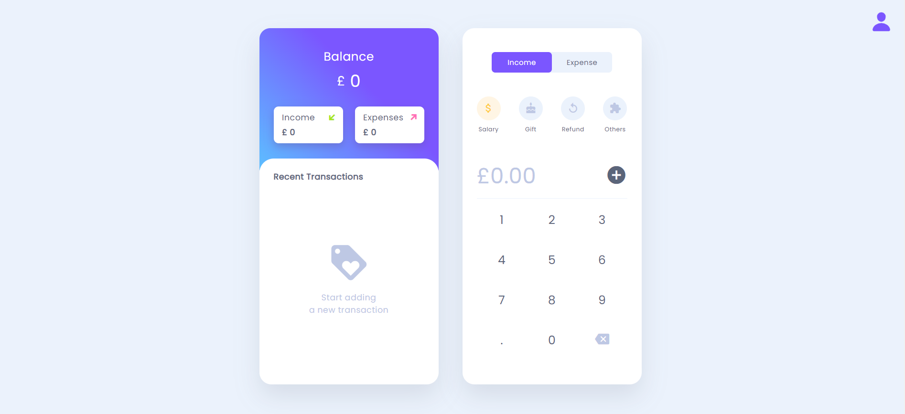

# Budget Application



This is a simple budget application project developed using HTML, CSS, and JavaScript.

## Table of Contents

- [Features](#features)
- [Demo](#demo)
- [Installation](#installation)
- [Usage](#usage)
- [Contributing](#contributing)
- [License](#license)
- [Acknowledgements](#acknowledgements)
- [Contact](#contact)

## Features

- **User-friendly interface**: Intuitive design for easy navigation.
- **Sign-up and sign-in functionality**: Secure registration and authentication process.
- **Budget management**: Add, edit, and delete budgets with ease.
- **Local data storage**: User data is stored locally using browser's local storage.
- **Responsive design**: Optimized for both mobile and desktop users.


## Installation

1. **Clone the repository:**

    ```bash
    git clone https://github.com/yourusername/budget-application.git
    ```

2. **Open the application:**

    Open the `index.html` file in your web browser to run the application.

## Usage

1. **Sign up:**

    - Enter your username, email, and password.
    - Click on the "Sign Up" button.

2. **Sign in:**

    - Enter your registered email and password.
    - Click on the "Sign In" button.

3. **Manage budgets:**

    - Add your budget details including name and amount.
    - Edit or delete budgets as needed.

## Contributing

This project is contributed by the following individuals:

- Abdullah Al Sady
- Abdullah Al Sabit Khan
- Abdul Aziz
- Golam Murshed Chowdhury

Contributions are welcome! Please feel free to fork the repository and submit pull requests to contribute to this project.


## Contact

For any inquiries or issues, please contact:
:email: [dev.sady@gmail.com](mailto:dev.sady@gmail.com)